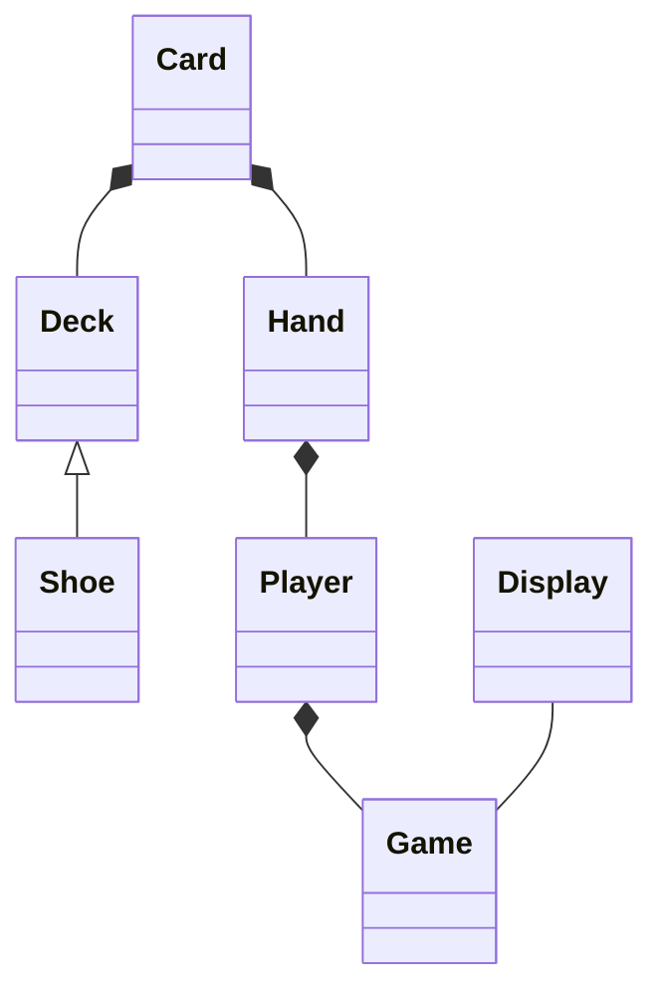

# Test-driven development for Blackjack
## Objective
We would like to develop a blackjack game using test-driven development method in python

### The initial plan for class is as the following.



### คิดแนว Topdown โดยเริ่มต้นจาก class Game

class Game
น่าจะมี play เป็น main method
และน่าจะต้องมี config ต่าง ๆ เช่น มีกี่ deck ใน shoe และเงื่อนไขต่าง ๆ

#### คิดรายละเอียดของ play method
ตอนนี้ ยังไม่ได้คิดถึงเรื่อง parameter ของ play แต่นึกภาพใหญ่ ๆ ก่อนน่าจะประกอบด้วย phase ต่าง ๆ ตามนี้คือ
1. init & set up phase
2. while loop for each player to play and dealer will play last
3. display result

ตอนนี้ focus ที่ phase 1 ก่อนว่า ก่อนที่จะเล่น blackjack จะต้อง init หรือ setup อะไรบ้าง ก็น่าจะมี
* สร้าง shoe
* สร้าง player & dealer

เพราะฉะนั้น เราจะเริ่มต้นที่การสร้าง shoe ก่อน
โดยเริ่มต้นการสร้าง test ก่อน

สร้าง directory structure ดังนี้
```
.
├── # Test-driven development for Blackjack.md
├── src
│   ├── __init__.py
│   └── shoe.py
└── test
    └── test_shoe.py
```
และเราสามารถรัน pytest ด้วย command
```bash
PYTHONPATH=. pytest
```
> เราต้องกำหนด PYTHONPATH ให้เป็น current directory เพื่อให้สามารถ import ได้